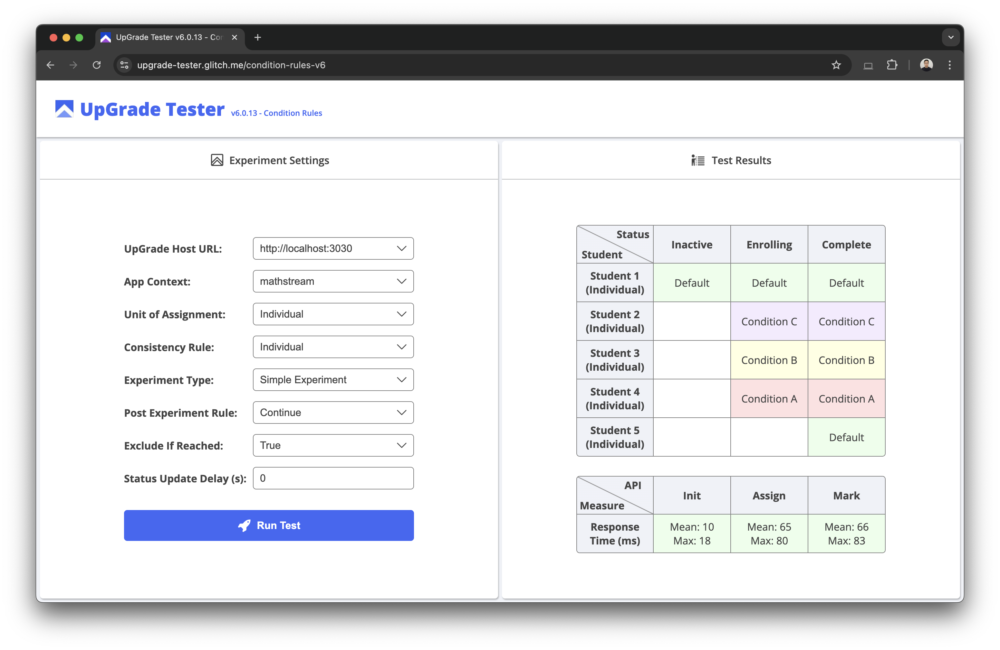

# UpGrade Tester


## Description
A simple app to test the functionality of [UpGrade](https://github.com/CarnegieLearningWeb/UpGrade), an open-source platform to support large-scale A/B testing in educational applications. Learn more at www.upgradeplatform.org

## Setup
1. You need to have [Python](https://realpython.com/installing-python/) installed on your computer
2. Run the following commands in the Terminal
```
git clone https://github.com/zackcl/upgrade-tester.git
cd upgrade-tester
python -m http.server 8000
```
3. Open your web browser and navigate to http://localhost:8000
